# MAMB Kids

Aplicación web interactiva del **Museo de Arte Moderno de Barranquilla (MAMB)** para niños y jóvenes, desarrollada en colaboración con la **Universidad Simón Bolívar**.

Los usuarios pueden fotografiar sus obras, aplicarles filtros artísticos simulados por IA, compartirlas en una galería comunitaria y ganar logros mientras exploran el arte moderno.

---

## Enlaces

| Recurso | URL |
|---|---|
| **App (dominio personalizado)** | [mambkids.online](https://mambkids.online) |
| **App (dominio Azure)** | [calm-desert-027745d10.7.azurestaticapps.net](https://calm-desert-027745d10.7.azurestaticapps.net/) |
| **Documentación** | [Samuel-David-Garcia-Mejia.github.io/mambkids](https://Samuel-David-Garcia-Mejia.github.io/mambkids/) |
| **Repositorio** | [github.com/Samuel-David-Garcia-Mejia/mambkids](https://github.com/Samuel-David-Garcia-Mejia/mambkids) |

---

## Capturas de pantalla

### 1. Información del Museo
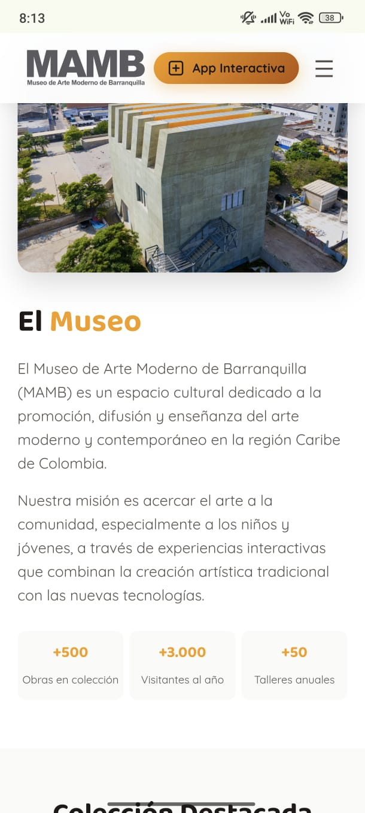

### 2. Información del Museo (Vista adicional)
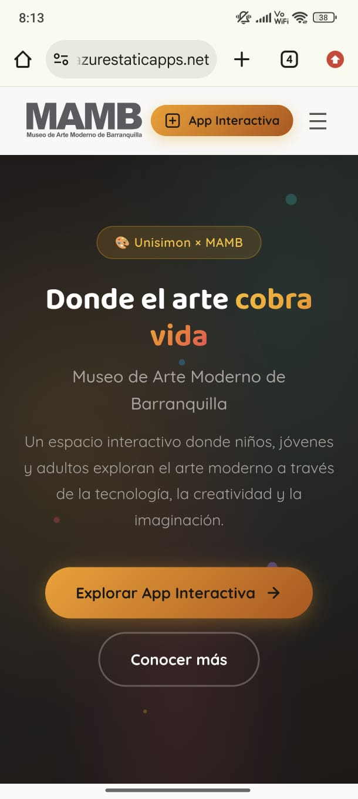

### 3. Inicio de Sesión y Registro


### 4. Crear Cuenta


### 5. Guía Tutorial


### 6. Página Principal


### 7. Información de Ubicación y Horarios


### 8. Juego Piedra, Papel o Tijera


### 9. Próximos Eventos


### 10. Crear Obra
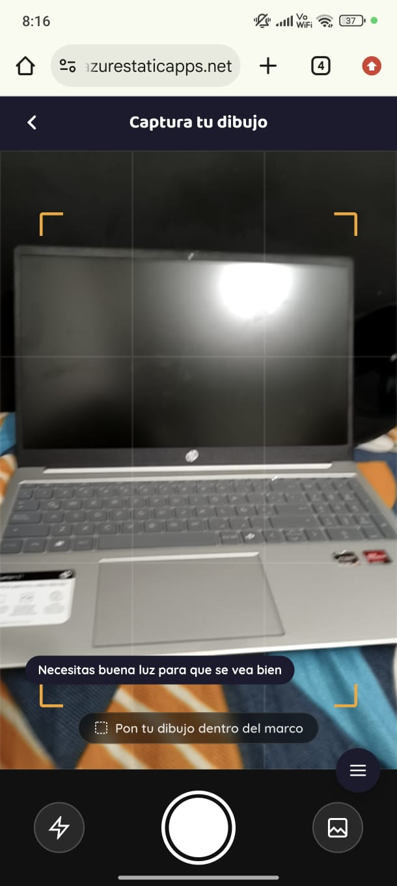

### 11. Información de la Obra


### 12. Editar Obra con IA
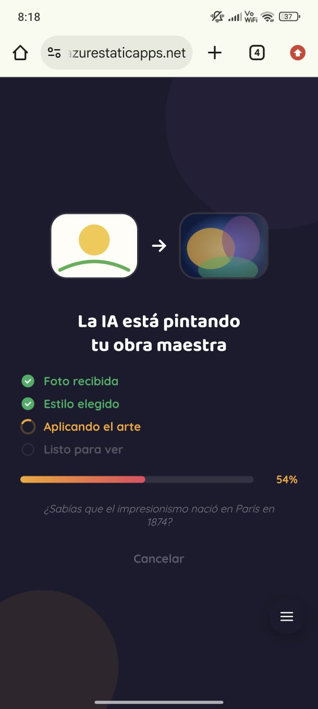

### 13. Publicar Obra


### 14. Galería de Obras
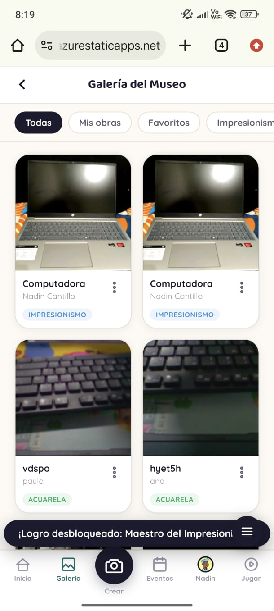

### 15. Perfil de Usuario
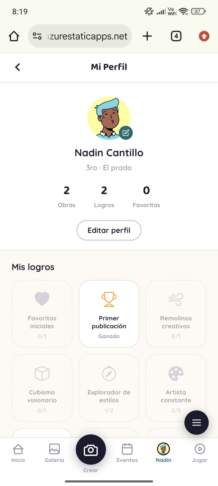

### 16. Agendar Eventos


---

## Funcionalidades

| Módulo | Descripción |
|---|---|
| **Cámara** | Captura fotos con `getUserMedia`, flash visual, cuadrícula de encuadre, personaje guía "Pinto" |
| **Filtros IA** | 6 estilos artísticos (Impresionismo, Van Gogh, Acuarela, Cubismo, Puntillismo, Fantasía) aplicados con Canvas API |
| **Galería** | Galería comunitaria y personal; visor con descarga de imagen y compartir por WhatsApp/email |
| **Logros** | Sistema de achievements con 8 logros desbloqueables según la actividad del usuario |
| **Perfil** | Estadísticas personales, obras publicadas, logros ganados |
| **Artistas** | Sección educativa con artistas destacados vinculados al MAMB |
| **Juego RPS** | Piedra, papel o tijera con detección de poses en tiempo real usando TensorFlow.js + Teachable Machine |

---

## Stack tecnológico

| Capa | Tecnología |
|---|---|
| Frontend | HTML5, CSS3, JavaScript (Vanilla) — SPA sin frameworks |
| Autenticación | Supabase Auth (email/contraseña) |
| Base de datos | Supabase PostgreSQL |
| Almacenamiento | Supabase Storage (`obras_bucket`) |
| IA — filtros | Canvas API (`ctx.filter`, `drawImage`) |
| IA — poses | TensorFlow.js 1.3.1 + Teachable Machine Pose |
| Iconos | Bootstrap Icons 1.11.3 |
| Hosting | Microsoft Azure Static Web Apps (plan Standard) |
| Dominio | Namecheap — `mambkids.online` |
| Documentación | Docusaurus 3.6.3 → GitHub Pages |

---

## Estructura del proyecto

```
mamb_prueba/
├── app.html                   # SPA principal (18 pantallas)
├── script.js                  # Lógica de la aplicación
├── styles.css                 # Estilos (mobile-first)
├── config.js                  # Inicialización de Supabase
├── index.html                 # Página de entrada
├── docs-site/                 # Sitio de documentación (Docusaurus)
│   ├── docs/                  # Páginas de documentación en Markdown
│   │   └── funcionalidades/   # Submódulos documentados
│   ├── src/                   # Componentes y estilos del sitio
│   └── static/                # Recursos estáticos (logo, favicon, imágenes)
└── .github/
    └── workflows/
        └── deploy-docs.yml    # CI/CD automático → GitHub Pages
```

---

## Base de datos (Supabase)

### `perfiles`
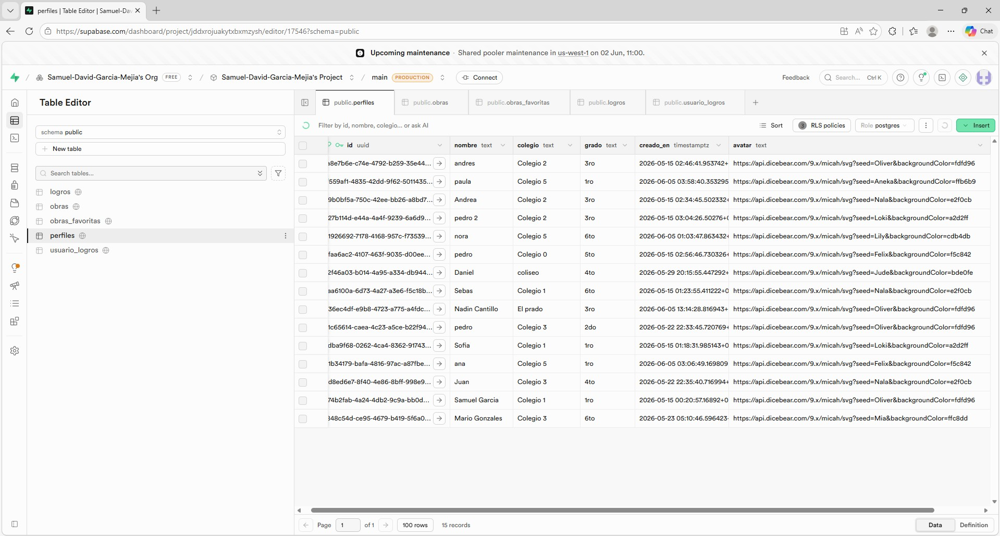

Extiende el usuario de Supabase Auth con datos del perfil escolar.

| Tabla | Descripción |
|---|---|
| `perfiles` | Datos del usuario: nombre, colegio, grado, avatar |

### `obras`
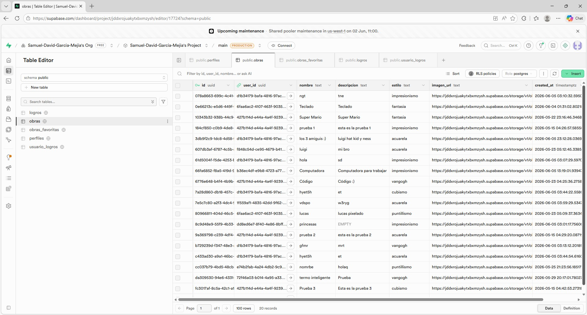

Almacena las obras creadas y publicadas por los usuarios.

| Tabla | Descripción |
|---|---|
| `obras` | Obras publicadas: imagen, estilo, descripción, visibilidad |

### `obras_favoritas`
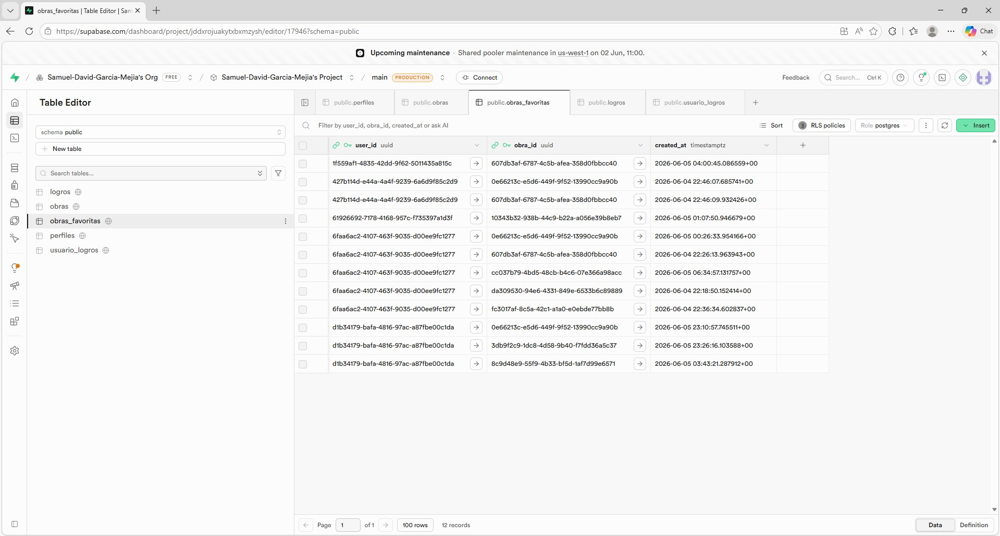

Relación muchos-a-muchos entre usuarios y obras marcadas como favoritas.

| Tabla | Descripción |
|---|---|
| `favoritos` | Relación usuario ↔ obra favorita |

### `logros`
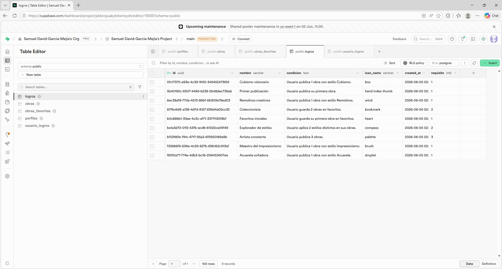

Catálogo estático de logros disponibles en la aplicación.

| Tabla | Descripción |
|---|---|
| `logros` | Catálogo de logros con condición y requisito numérico |

### `usuario_logros`
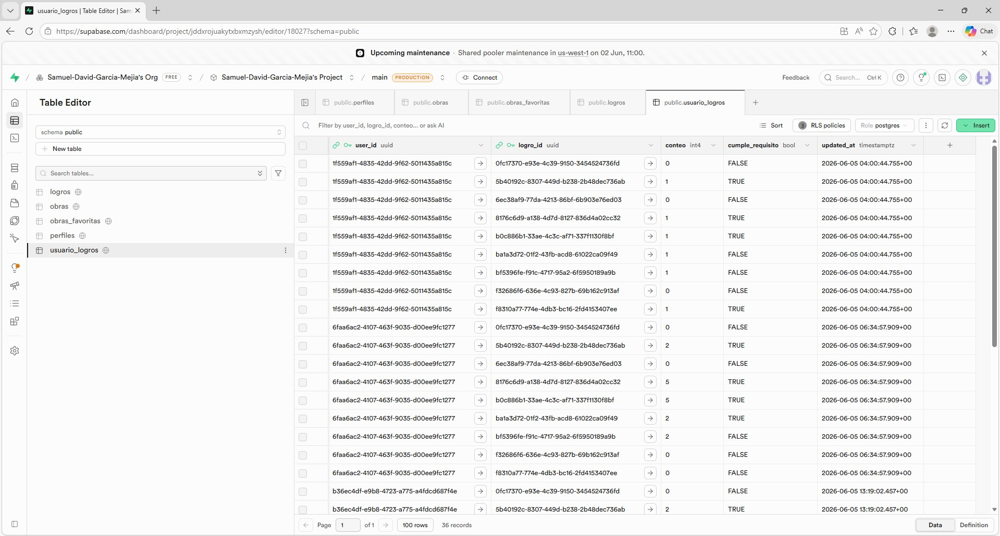

Registra el progreso individual de cada usuario hacia cada logro.

| Tabla | Descripción |
|---|---|
| `usuario_logros` | Progreso por usuario: conteo y `cumple_requisito` |

---

## Despliegue y dominio

La app está alojada en **Microsoft Azure Static Web Apps** (plan **Standard**) y cuenta con dos dominios activos:

- **Dominio automático de Azure:** `calm-desert-027745d10.7.azurestaticapps.net`
- **Dominio personalizado:** `mambkids.online` (comprado en Namecheap)

### Configuración del dominio personalizado (Namecheap + Azure)

> **Nota:** Para vincular un dominio personalizado en Azure Static Web Apps es necesario contar con el plan **Standard**. El plan Free no admite esta función; se realizó el cambio de plan antes de iniciar el proceso.

1. Se compró el dominio `mambkids.online` en [namecheap.com](https://www.namecheap.com).
2. Desde Azure → Static Web App → **Hosting plan**, se cambió la suscripción de **Free** a **Standard**.
3. Desde Azure → **Custom domains**, se solicitó agregar `mambkids.online`. Azure proporcionó un registro **TXT** y un registro **CNAME**.
4. Esos valores se copiaron y pegaron en **Namecheap → Advanced DNS** del dominio.
5. Tras la propagación DNS, Azure validó el dominio y lo activó con HTTPS automático.

---

## Instalación local

```bash
# 1. Clona el repositorio
git clone https://github.com/Samuel-David-Garcia-Mejia/mambkids.git

# 2. Configura Supabase en config.js
#    (reemplaza SUPABASE_URL y SUPABASE_ANON_KEY con tus credenciales)

# 3. Abre app.html en un servidor local
#    (XAMPP, Live Server de VS Code, etc.)
```

Para levantar el sitio de documentación localmente:

```bash
cd docs-site
npm install
npm run start    # servidor en http://localhost:3000
```

---

## Equipo

| Nombre | Rol |
|---|---|
| Samuel David García Mejía | Líder del proyecto y Desarrollador |
| Nadín Elías Cantillo Gómez | Desarrollador |
| Valeria Melissa Patrón García | Desarrolladora |

---

## Institución

Proyecto académico desarrollado para el **Museo de Arte Moderno de Barranquilla (MAMB)** en colaboración con la **Universidad Simón Bolívar** — Barranquilla, Colombia.
