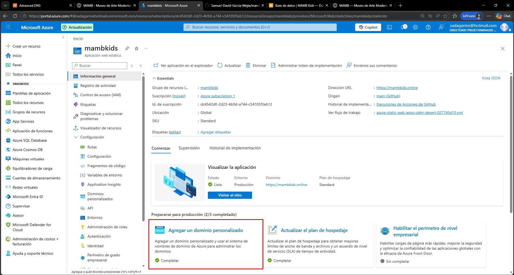
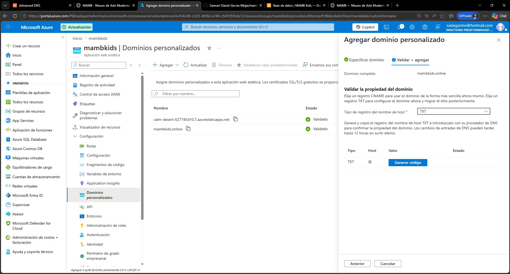
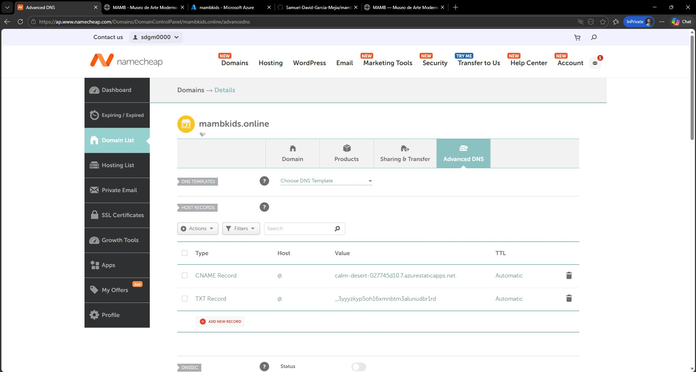
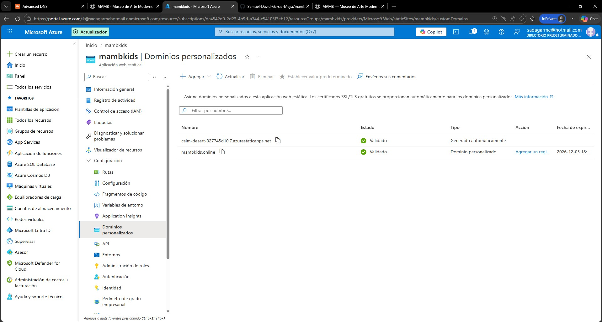
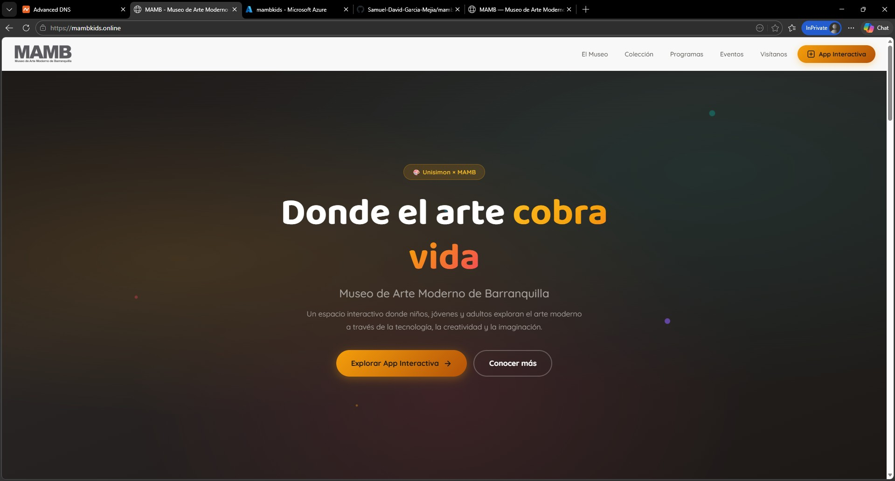

# Despliegue y dominio

MAMB Kids está desplegada en la nube mediante **Microsoft Azure Static Web Apps** y cuenta con dos dominios activos.

## Dominios activos

| Tipo | URL |
|---|---|
| Dominio personalizado | [mambkids.online](https://mambkids.online) |
| Dominio automático de Azure | [calm-desert-027745d10.7.azurestaticapps.net](https://calm-desert-027745d10.7.azurestaticapps.net/) |

---

## Hosting — Microsoft Azure Static Web Apps

La aplicación es un sitio estático (HTML + CSS + JS, sin servidor propio), lo que la hace compatible con Azure Static Web Apps sin ninguna configuración adicional de servidor.

**Características del servicio usado:**

- HTTPS automático en todos los dominios.
- Despliegue continuo conectado al repositorio de GitHub.
- CDN global incluido.
- **Plan utilizado: Standard.** Para poder vincular un dominio personalizado en Azure Static Web Apps es necesario contar con el plan Standard (el plan Free no admite dominios personalizados).

---

## Dominio personalizado — mambkids.online

El dominio fue adquirido en [Namecheap](https://www.namecheap.com) y vinculado a la Static Web App de Azure mediante registros DNS.

### Pasos realizados

**1. Compra del dominio**

Se buscó y adquirió el dominio `mambkids.online` en namecheap.com.

**2. Cambio de plan en Azure (Free → Standard)**

Antes de poder agregar un dominio personalizado, se cambió la suscripción de la Static Web App de **Free** a **Standard** desde el portal de Azure → Static Web App → **Hosting plan**.

**3. Solicitud de registros DNS en Azure**

Desde el portal de Azure:

1. Ir a la Static Web App → sección **Custom domains**.



2. Hacer clic en **Add** e ingresar `mambkids.online`.
3. Azure genera los valores de validación: un registro **TXT** y un registro **CNAME**.



**4. Configuración en Namecheap**

1. Iniciar sesión en namecheap.com → **Domain List** → **Manage** sobre `mambkids.online`.
2. Ir a la pestaña **Advanced DNS**.
3. Agregar los dos registros proporcionados por Azure:



| Tipo | Host | Valor |
|---|---|---|
| `TXT` | `@` | Valor de verificación entregado por Azure |
| `CNAME` | `www` (o `@`) | Valor del endpoint de Azure |

4. Guardar los cambios.

**5. Validación y activación**

- Azure verifica los registros DNS automáticamente (puede tardar entre unos minutos y 48 horas según la propagación).



- Una vez validado, Azure activa HTTPS automáticamente para el dominio personalizado.



---

## Documentación — GitHub Pages

El sitio de documentación (este sitio) está generado con **Docusaurus 3.6.3** y desplegado en GitHub Pages.

- **Repositorio:** [github.com/Samuel-David-Garcia-Mejia/mambkids](https://github.com/Samuel-David-Garcia-Mejia/mambkids)
- **URL de la documentación:** [Samuel-David-Garcia-Mejia.github.io/mambkids](https://Samuel-David-Garcia-Mejia.github.io/mambkids/)

El deploy es automático: cada vez que se hace push a la rama `main` con cambios en la carpeta `docs-site/`, el workflow de GitHub Actions construye y publica la documentación en la rama `gh-pages`.

```yaml title=".github/workflows/deploy-docs.yml"
on:
  push:
    branches: [main]
    paths:
      - 'docs-site/**'
```

Para desplegar la documentación manualmente desde local:

```powershell
$env:GIT_USER = "Samuel-David-Garcia-Mejia"
cd docs-site
npm run deploy
```
